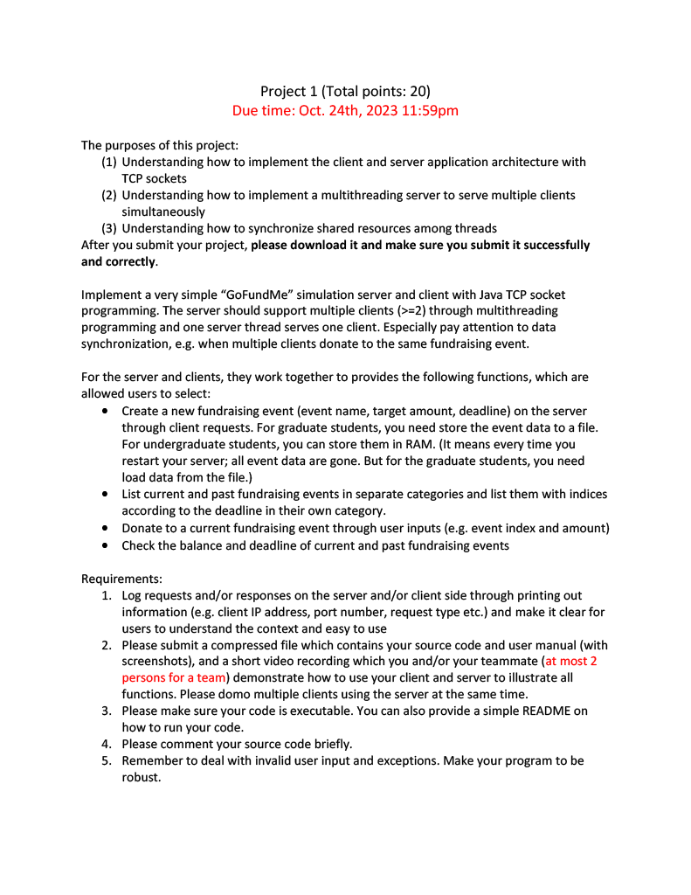

# CSCI-455-Project-1-Server
This is the server application for project 1 for CSCI 455

If you are looking for the client application the github repository for it is here [Client application](https://github.com/brandon57/CSCI-455-Project-1-Client)

# These are the requirements for the project
<p align="center">
  
</p>

<p align="center">
  
</p>

# How to start the server
In order to run the server you need to open the command line or powershell and navigate to the directory of where the file is located.
Once you do that you can start the program by typing this command `java -jar Server.jar`

Once you do that you you should be greeted with with a screen asking you to set the port number for your server.
```text
What is the port number of the server? Your input should be between 0-65535
You can exit if you want.
```
After typing in a valid port number you should see this screen.
```text
Opening Socket...
Socket is open
```
Seeing this means that the server is now running and waiting for users to connect.
